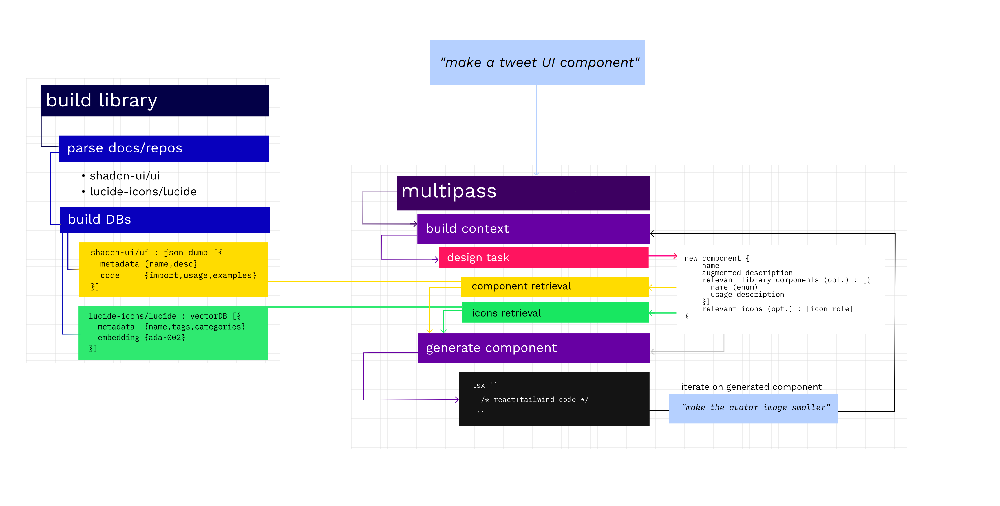

# openv0

**openv0** is a generative UI component tool

It allows you to AI generate and iterate on React+Tailwind components, with live preview. openv0 makes use of library components from [shadcn/ui](https://ui.shadcn.com/) and icons from [lucide-icons/lucide](https://lucide.dev/)

The open-source project is inspired by vercel's [v0.dev](https://v0.dev/), which, at the time of writing, is still on private waitlisted alpha

Say hi [@n_raidenai](https://twitter.com/n_raidenai) 👋

Client is based on [React + Vite + TypeScript + shadcn/ui Template (react-vite-ui)](https://github.com/Dan5py/react-vite-ui/)

## Demo

[openv0_demo.webm](https://github.com/raidendotai/openv0/assets/127366981/53b14c27-22ec-40a3-a431-539daf197f49)

## How It Works

Here is a simple explanation



## Local Development

Enable corepack:

```sh
corepack enable
```

Install dependencies:

```sh
pnpm install
```

Start server

```sh
pnpm start
```

Go to http://localhost:3000/
